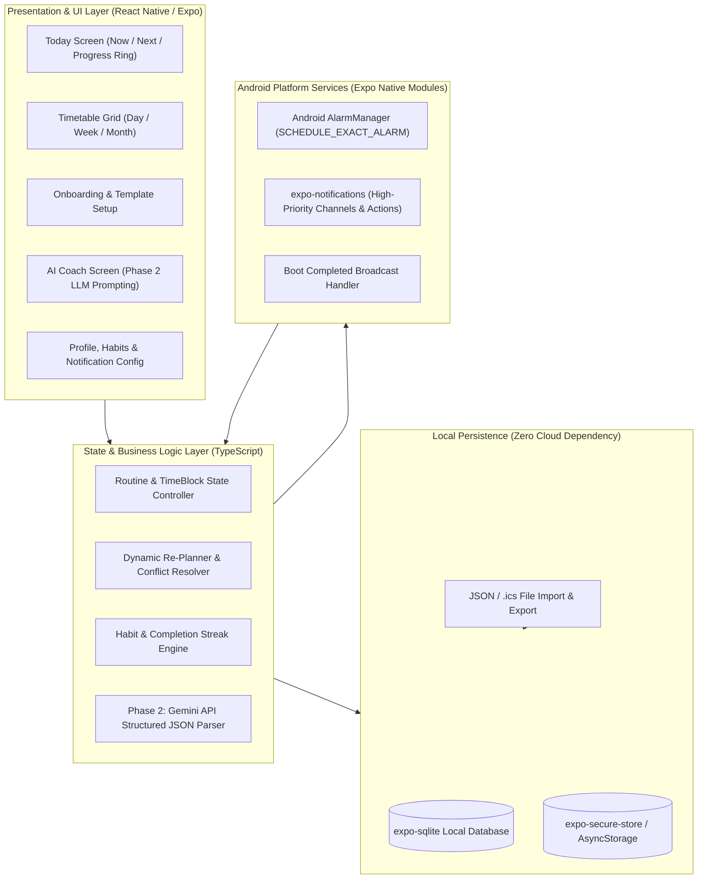
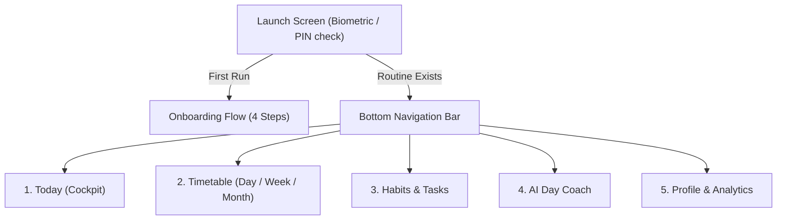
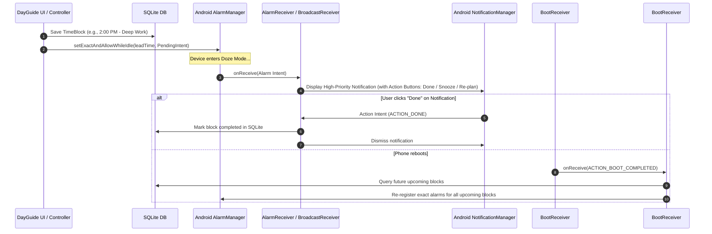

# DayGuide: App Architecture, UX Blueprint & Implementation Plan

---

## 1. System Architecture Overview

DayGuide is built on an **Offline-First Reactive Architecture**. The application operates completely autonomously on the local device without requiring an active internet connection.



---

## 2. Screen-by-Screen Blueprint & Navigation Hierarchy

### 2.1 Navigation Structure


---

### 2.2 Detailed Screen Layouts & Specifications

#### 1. Today Screen ("The Cockpit") - Default View
- **Header:** Date, greeting, current energy focus, daily completion percentage badge.
- **Hero "NOW" Card (High Contrast / Vibrant):**
  - Title of active block (e.g., *"Deep Work - Backend Architecture"*).
  - Category pill (e.g., `Focus / Work` in indigo/blue).
  - Live Circular Timer: countdown remaining in block (e.g., `28m left`).
  - Action row:
    - `[✓ Done]` (Single tap marks completed, records streak, triggers haptic).
    - `[+10m Snooze]` (Extends block, checks for downstream collision).
    - `[Skip]` (Marks skipped, optionally opens re-plan suggestion).
- **"NEXT" Sub-card:**
  - Upcoming block title, scheduled time (e.g., *"12:30 PM - Lunch & Walk"*), time until transition (`Starts in 32m`).
- **"Rest of Your Day" Vertical Timeline:**
  - Compact scrollable timeline with start/end chips and priority indicators.
- **Floating Action Button (FAB):**
  - Quick action: *"Insert Quick Task"* or *"Re-plan Afternoon"*.

#### 2. Timetable Screen (Interactive Schedule)
- **View Toggle:** `[ Day ]` | `[ Week ]` | `[ Month ]`.
- **Day View:** 24h vertical grid (15-min snapping). Drag-and-drop handles to shift or resize blocks.
- **Conflict Highlighting:** Overlapping blocks glow with amber warning border.
- **Block Inspector Bottom Sheet:**
  - Title, category picker, fixed vs. flexible toggle, notification lead time, recurrence rules (e.g., Weekdays).

#### 3. Habits & Task Backlog
- **Habit Matrix:**
  - Habit card with current streak count (🔥 12 days), weekly heat dot map (M T W T F S S).
  - 1-tap quick check-in.
- **Unassigned Task Bucket:**
  - List of backlog tasks with estimated durations (e.g., `Read Documentation - 30m`).
  - Drag tasks directly from bucket into free gaps on the timetable.

#### 4. AI Day Coach & Re-Planning Assistant
- **Conversational Interface:** Clean chat-style or prompt input.
- **Quick Action Chips:**
  - `[Fix my afternoon]`
  - `[Reschedule missed items]`
  - `[Insert 1h Gym today at 5 PM]`
- **Proposal Preview Diff Card:**
  - Visual before-and-after comparison of schedule changes.
  - Clear `[Apply Changes]` and `[Discard]` actions.

#### 5. Profile, Analytics & Backup
- **Daily / Weekly Analytics:** Planned vs. actual completed hours, time distribution chart per category (Pie/Bar).
- **Routines & Sleep Anchors:** Wake time, bedtime, quiet hours.
- **Data Management:** `Export Backup (.json)` / `Import Backup` / `Export Calendar (.ics)`.

---

## 3. Dynamic Re-Planning Engine (Algorithmic Logic)

When a block is missed, runs long, or an unexpected event is injected:

```mermaid
flowchart TD
    A[Trigger: Missed Block / Delay / Manual Re-plan] --> B[Identify Schedule State]
    B --> C[Fetch Current Time + Remaining Blocks for Today]
    C --> D[Separate Blocks: Fixed vs Flexible]
    D --> E[Preserve Fixed Commitments (Meetings, Appointments)]
    E --> F[Calculate Available Gaps / Free Time Windows]
    F --> G[Sort Missed/Flexible Tasks by Priority (P0 > P1 > P2)]
    G --> H[Fit Tasks into Free Windows]
    H --> I{Do all tasks fit before Bedtime?}
    I -->|Yes| J[Generate Proposed New Timetable]
    I -->|No| K[Propose deferring lowest priority flexible tasks to tomorrow]
    K --> J
    J --> L[Present Visual Diff to User for 1-Tap Approval]
    L -->|User Confirms| M[Update SQLite DB & Reschedule AlarmManager Alarms]
    L -->|User Rejects| N[Keep Existing Timetable]
```

---

## 4. Android Background Alarms & Notification Architecture

Ensuring notifications fire reliably even with aggressive Android battery optimizations (Doze mode, OEM restrictions):



---

## 5. Development Roadmap & Implementation Milestones

### Phase 1: MVP Foundations (Weeks 1 – 3)
- [x] PRD and architecture definition.
- [x] Tech stack confirmed: React Native / Expo (TypeScript) + expo-sqlite.
- [ ] Initialize Expo project with Expo Router & TypeScript.
- [ ] Implement SQLite schema with `expo-sqlite` (TimeBlocks, Profiles, Categories).
- [ ] Build Onboarding Questionnaire + archetypes.
- [ ] Build Today Screen (Now / Next / Circular countdown / Done-Skip-Snooze).
- [ ] Build Timetable Day & Week views.
- [ ] Integrate `expo-notifications` for local schedule reminders with Android actions.
- [ ] Test on Android phone via Expo Go & generate standalone preview APK.

### Phase 2: Intelligence & Habits (Weeks 4 – 5)
- [ ] Habit tracker & daily streak calculation engine.
- [ ] Unassigned task drawer with drag-to-schedule.
- [ ] Dynamic Re-Planning Engine (1-tap rearrange missed blocks).
- [ ] AI Planning Assistant (Gemini API integration -> structured JSON timetable diff).
- [ ] Backup & restore (Export/Import JSON file).

### Phase 3: Analytics, Companion & Polish (Weeks 6 – 7)
- [ ] Daily/Weekly visual analytics (time spent by category).
- [ ] Google Calendar `.ics` file import/export.
- [ ] Android Home Screen Widget / Web companion polish.
- [ ] Release final standalone personal APK package.

