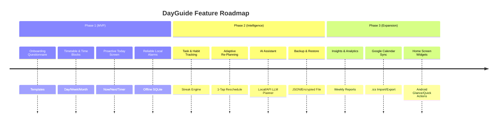
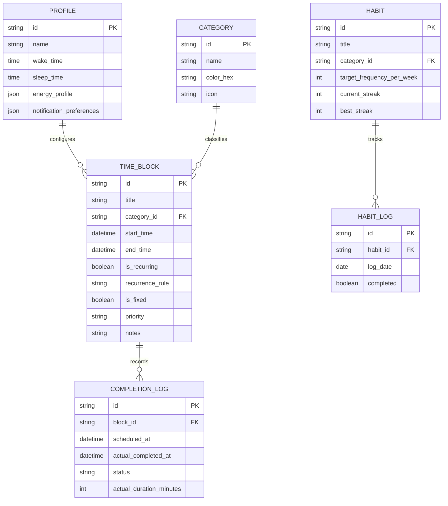

# Product Requirements Document (PRD): DayGuide
**Daily Routine Guide App (Android & Cross-Platform / Web Ready)**

---

## 1. Document Control & Metadata
- **Project Name:** DayGuide (Daily Routine Guide)
- **Status:** Approved / Architecture Phase
- **Target Platform:** Android (Personal direct APK install / Side-load), designed with Web/Desktop companion readiness
- **Version:** 1.0 (MVP)
- **Distribution:** Personal deployment (No Play Store review required)
- **Primary Mode:** 100% Offline-First

---

## 2. Executive Summary & Vision
**DayGuide** is an intelligent, proactive calendar and timetable application designed to act as a **personal day coach**. Unlike passive calendar tools (Google Calendar, Outlook) or static task managers (Todoist, TickTick) that wait for user lookups, DayGuide actively brings the routine to the user:
- **Now:** What should you be focusing on right now?
- **Next:** What is coming next and how to prepare?
- **Missed / Deviated:** How to dynamically adapt and re-plan the day when real-life disruptions happen.

### Core Philosophy
1. **Zero Friction:** One-tap actions (Done, Skip, Snooze, Re-plan).
2. **Proactive Guidance:** Never miss a transition; gentle and timely notifications.
3. **Adaptive Resilience:** When a block slips, the app re-balances the remaining hours rather than making the user feel guilty.
4. **Complete Privacy:** 100% local-first data storage on the device with zero cloud lock-in.

---

## 3. Problem Statement & User Pain Points
| Pain Point | Current Behavior with Existing Tools | DayGuide Solution |
| :--- | :--- | :--- |
| **Passive Calendars** | Events sit quietly on a grid; user forgets to check. | Proactive "Now / Next" dashboard with lock screen and actionable notifications. |
| **Rigid Scheduling** | If a 10:00 AM task runs over by 30 mins, the entire rest of the schedule breaks. | **Adaptive Re-planning:** One-tap re-balance of remaining free slots. |
| **Overwhelming Setup** | Creating 15 time blocks daily is exhausting. | Guided onboarding questionnaire + archetype templates (Student, Freelancer, Professional). |
| **Tracking Fatigue** | Manual logging takes too many clicks. | Single-tap completion, streak increments, and timer integration. |
| **Privacy Concerns** | Cloud calendars track user data and habits. | All data, habits, and schedules reside locally on device in SQLite. |

---

## 4. Target User & Persona
- **Primary Owner:** Individual power user seeking disciplined daily rhythm, work-life balance, and habit consistency.
- **Key Routine Domains:**
  - **Work & Projects:** Deep focus sessions, client meetings, administrative tasks.
  - **Learning & Study:** Skill development, reading, research.
  - **Health & Wellness:** Sleep schedule, meals, workouts, breaks.
  - **Personal Rhythms:** Morning devotion, meditation, journaling, evening wrap-up.

---

## 5. Scope & Phased Roadmap

### Non-Goals (MVP)
- Multi-user collaboration or shared family calendars.
- Public Google Play Store listing / in-app subscriptions / paywalls.
- Centralized user account servers (no Firebase Auth / cloud DB requirement for MVP).

---

## 6. Functional Requirements (FR)

### 6.1 Profile & Guided Onboarding (P0)
- **[FR-1.1] Questionnaire Flow:** Collects core parameters:
  - Wake-up time & target bedtime.
  - Core work/school fixed commitments.
  - Meal intervals (breakfast, lunch, dinner).
  - Target habits (e.g., 30m workout, 20m reading, devotion).
  - Peak cognitive focus hours (Morning / Afternoon / Night).
- **[FR-1.2] Preset Archetypes:** Fast start templates:
  - *Developer / Freelancer:* Deep work blocks, Pomodoro breaks, client check-ins.
  - *Student:* Study slots, lecture hours, revision periods.
  - *Balanced Routine:* 9-to-5 structure, health, leisure, evening wind-down.
- **[FR-1.3] Profile Editing:** All onboarding answers remain directly editable in `Profile & Settings`.

### 6.2 Timetable & Scheduling Engine (P0)
- **[FR-2.1] Multi-View Calendar:**
  - **Day View:** 24-hour visual vertical timeline with distinct color-coded blocks.
  - **Week View:** 7-day compact grid showing routine distribution.
  - **Month View:** High-level view of habit completion and major commitments.
- **[FR-2.2] Time Block Attributes:**
  - Title, category (Work, Health, Learning, Rest, Routine), color, priority (P0-Critical, P1-Normal, P2-Flexible).
  - Fixed vs. Flexible flag (Flexible blocks can be dynamically shifted during re-planning).
  - Recurring rules: Daily, Weekdays, Weekends, Custom Day intervals (RRULE compatible).
- **[FR-2.3] Overlap & Conflict Detection:** Visual warnings when flexible blocks collide with fixed commitments.

### 6.3 Proactive Today Screen ("The Cockpit") (P0)
- **[FR-3.1] "Now" Focus Hero Card:**
  - Displays currently active routine block.
  - Live countdown timer showing minutes remaining in the block.
  - Quick action buttons: **Complete (Done)**, **Skip**, **Snooze (+10m / +15m)**.
- **[FR-3.2] "Next" Card:**
  - Displays upcoming block, scheduled start time, and countdown until transition.
- **[FR-3.3] "Remaining Day" Timeline:**
  - Chronological list of upcoming blocks for today.
- **[FR-3.4] Progress Ring / Dial:**
  - Real-time circular percentage metric showing completed vs. planned day duration.
- **[FR-3.5] Daily Briefing & Wrap-Up:**
  - Morning overview at wake time.
  - Evening reflection at bed time comparing planned vs. completed activities.

### 6.4 Smart Local Reminders & Notifications (P0)
- **[FR-4.1] Offline Scheduled Exact Alarms:**
  - Uses native exact alarm scheduling (e.g., Android `AlarmManager` / Exact Alarms API).
  - Independent of internet access; functions in Airplane Mode.
- **[FR-4.2] Transition Warnings:**
  - Configurable notification lead time (e.g., 5 min, 10 min, or at exact start).
- **[FR-4.3] Actionable Notifications:**
  - Notification bar buttons: Mark Done, Snooze (+10m), Reschedule.
- **[FR-4.4] Persistence across Reboots:**
  - Broadcast receiver registers `BOOT_COMPLETED` to restore all pending reminders upon device restart.
- **[FR-4.5] Quiet Hours & DND Respect:**
  - Adheres to Android Do Not Disturb settings and user-specified quiet hours.

### 6.5 Monthly Goal Tracker & Breakdown Engine (P0)
- **[FR-5.1] Monthly Outcome Goals:** Define high-level goals for the current month across categories (Deep Work, Health, Learning, Personal).
- **[FR-5.2] 4-Week Structured Decomposition:**
  - Automatically helps break each monthly goal into 4 weekly action milestones:
    - *Week 1:* Foundation, setup, and initial 25% target.
    - *Week 2:* Core execution sprint (50% target).
    - *Week 3:* Iteration, deep momentum, and 75% target.
    - *Week 4:* Final wrap-up, review, and shipping.
- **[FR-5.3] Milestone to Timetable Bridge:** Single-tap to schedule any weekly milestone directly as a focused TimeBlock in the daily timetable.
- **[FR-5.4] Visual Progress Tracking:** Dynamic percentage completion bar and completed milestones counter.

### 6.6 Task & Habit Tracking Engine (P1)
- **[FR-6.1] Task Drawer:** Backlog of unallocated tasks that can be dragged directly into timetable empty slots.
- **[FR-6.2] Habit Streaks:** Daily and weekly streak counters for recurring behaviors (e.g., Workout, Reading, Devotion).
- **[FR-6.3] History & Audit Log:** Timestamped completion log for each block, habit, and task.

### 6.6 Adaptive Re-Planning (P1)
- **[FR-6.1] Missed Block Detection:** Detects when a scheduled block expires without being marked "Done".
- **[FR-6.2] 1-Tap Smart Reschedule:**
  - Identifies downstream unallocated time gaps.
  - Shifts remaining flexible blocks while keeping fixed commitments locked.
  - Prompts user with proposed new itinerary for confirmation.

### 6.7 AI Planning Assistant (P1)
- **[FR-7.1] Natural Language Command Input:**
  - Example: *"I have an urgent 2 PM client call for 1 hour and want to hit the gym at 5 PM. Rearrange my afternoon."*
- **[FR-7.2] Structured JSON Transformation:**
  - LLM evaluates current state + user prompt and returns structured block modifications (`add`, `reschedule`, `split`).
- **[FR-7.3] Explicit Human Confirmation:**
  - Preview diff shown before any schedule changes are committed.

### 6.8 Backup, Privacy & Sync (P0 / P2)
- **[FR-8.1] Local SQLite Storage (P0):** Fully contained on device.
- **[FR-8.2] Manual File Export/Import (P1):** JSON backup exportable to device storage, Google Drive, or SD card.
- **[FR-8.3] Calendar Integration (P2):** Standard `.ics` file export and Google Calendar `.ics` import.

---

## 7. Non-Functional Requirements (NFR)
- **[NFR-1] Performance:** App cold launch in `< 1.2s`, Today screen render in `< 200ms`.
- **[NFR-2] Reliability:** Alarm trigger precision within 15 seconds of target time; zero missed notifications due to OS aggressive battery optimization.
- **[NFR-3] Privacy & Security:** Zero telemetries or routine data uploaded to remote servers without explicit user setup. Optional biometric / PIN lock on app launch.
- **[NFR-4] Battery Efficiency:** Background wake locks kept to micro-second intervals strictly during alarm trigger; idle battery drain `< 1%` per 24 hours.
- **[NFR-5] UI/UX Aesthetics:** Modern high-contrast dark/light mode, smooth fluid animations, legible typography (Inter / Outfit), and touch-friendly drag-and-drop targets.

---

## 8. Data Model Entities

---

## 9. Confirmed Decisions & Implementation Baseline
1. **Framework Selected:** **React Native / Expo (TypeScript)**.
   - Cross-platform architecture: primary compilation target is Android APK for local installation, with Expo Web companion support.
2. **AI Planning Assistant Scope:** **Phase 2**.
   - Phase 1 (MVP) is strictly dedicated to core offline-first scheduling, local SQLite database, proactive Today cockpit, and exact notifications.
   - Phase 2 will introduce the Gemini LLM planning assistant and adaptive re-planning heuristics.
3. **Storage Engine:** `expo-sqlite` (embedded local SQLite database with zero cloud dependency).
4. **Notification Engine:** `expo-notifications` with local scheduled notifications and Android foreground channel prioritization.

